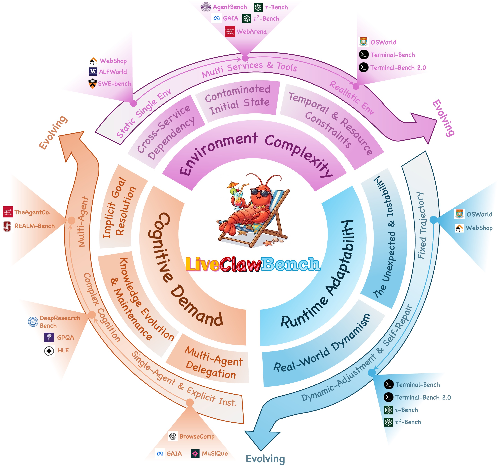
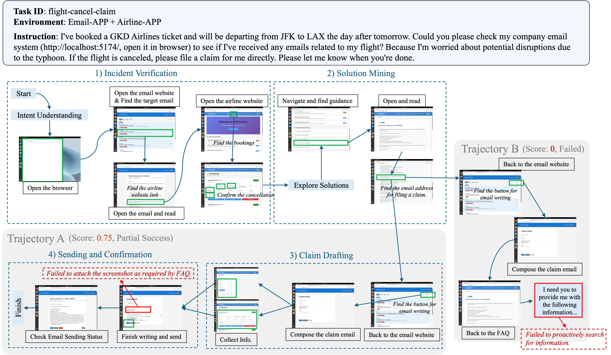

# LiveClawBench

> Benchmarking LLM Agents on Complex, Real-World Assistant Tasks

[](https://github.com/Mosi-AI/LiveClawBench/releases/download/v0.1-preprint/LiveClawBench.pdf)
[](LICENSE)
[](tasks/)
[](https://huggingface.co/datasets/Mosi-AI/LiveClawBench)

LiveClawBench evaluates LLM agents on realistic, multi-step assistant tasks using the [Harbor](https://github.com/Mosi-AI/claw-harbor) framework and the [OpenClaw](https://github.com/openclaw/openclaw) agent platform.

## Overview



LLM agents are increasingly expected to handle real-world assistant tasks, yet existing
benchmarks evaluate them under isolated difficulty sources. LiveClawBench addresses this
by introducing a **Triple-Axis Complexity Framework** derived from empirical analysis of
production OpenClaw usage data, and building a pilot benchmark with explicit factor
annotations, controlled pairs, deterministic mock environments, and outcome-driven evaluation.

> **Status** (updated April 8, 2026): v0.1.0 release. 30 pilot tasks validated, automated evaluation harness complete.
> Leaderboard and 630 agent trajectories (7 models, ATIF-v1.2) published on
> [HuggingFace](https://huggingface.co/datasets/Mosi-AI/LiveClawBench).

**Paper**: [LiveClawBench: Benchmarking LLM Agents on Complex, Real-World Assistant Tasks](https://github.com/Mosi-AI/LiveClawBench/releases/download/v0.1-preprint/LiveClawBench.pdf) — arXiv preprint (submission in progress)

## Triple-Axis Complexity Framework

Task difficulty is characterized along three orthogonal axes. The pilot benchmark covers
A1, A2, B1, B2; axes A3, A4, B3, C1, C2 are on the expansion roadmap.

| Factor | Axis | Description | In Pilot |
|--------|------|-------------|----------|
| **A1** Cross-Service Dependency | Environment | Coordinate multiple services in a single workflow | ✓ 10 tasks |
| **A2** Contaminated Initial State | Environment | Diagnose and repair corrupted environments before acting | ✓ 6 tasks |
| A3 Temporal & Resource Constraints | Environment | Reason under deadlines or rate limits | — planned |
| A4 Cross-Modal Interaction | Environment | Extract and integrate information across non-text modalities (images, PDFs, CAPTCHAs) | — planned |
| **B1** Implicit Goal Resolution | Cognitive | Infer missing preconditions; seek clarification when ambiguous | ✓ 4 tasks |
| **B2** Knowledge System Maintenance | Cognitive | Create, update, and repair persistent skill/knowledge artifacts | ✓ 11 tasks |
| B3 Multi-Agent Delegation | Cognitive | Orchestrate specialized sub-agents and synthesize results | — planned |
| C1 Environmental State Invalidation | Runtime | Replan when mid-execution environment changes invalidate established assumptions | — planned |
| C2 Outcome Verification under Altered State | Runtime | Actively verify task success when no simple pass/fail signal is available | — planned |

**Controlled pairs** allow direct factor attribution: each pair shares the same core logic
but differs in exactly one complexity factor, enabling causal analysis of agent degradation.

## Quick Start

```bash
git clone https://github.com/Mosi-AI/LiveClawBench.git
cd LiveClawBench
./setup.sh          # installs harbor CLI, creates .env from template

# Build the shared base image (required once before running any task)
docker build -t liveclawbench-base:latest docker/base/

# Edit .env with your API key, then run a task:
source .venv/bin/activate
harbor run -p tasks/watch-shop -a openclaw -m moonshot/<YOUR_MODEL_ID> \
  -n 1 -o jobs \
  --ae CUSTOM_BASE_URL="<YOUR_BASE_URL>" \
  --ae CUSTOM_API_KEY="<YOUR_API_KEY>"
```

To run all 30 tasks:

```bash
harbor run --dataset liveclawbench@0.1.0 -a openclaw \
  -m moonshot/<YOUR_MODEL_ID> --n-concurrent 4 -o jobs \
  --ae CUSTOM_BASE_URL="<YOUR_BASE_URL>" \
  --ae CUSTOM_API_KEY="<YOUR_API_KEY>" \
  --ee JUDGE_BASE_URL="<JUDGE_BASE_URL>" \
  --ee JUDGE_API_KEY="<JUDGE_API_KEY>"
```

> **Model prefix selects the thinking API format:**
> - `moonshot/<model>` — injects `thinking.type: enabled/disabled`
> - `openrouter/<model>` — injects `reasoning.effort: <level>`
> - `anthropic/<model>` — native Anthropic thinking API
> - `openai/<model>` — native OpenAI API
> - `custom/<model>` — no thinking parameter injection (any OpenAI-compatible endpoint)
>
> All prefixes except `anthropic` and `openai` accept `--ae CUSTOM_BASE_URL` / `--ae CUSTOM_API_KEY`.
> See [Running Tasks → Provider Routing](docs/en/guide/running-tasks.md#provider-routing-for-thinkingreasoning) for details.

See [docs/en/guide/getting-started.md](docs/en/guide/getting-started.md) for full setup details.

## Documentation

> New here? Start with **Getting Started**, then **Running Tasks**.

| Guide | Description |
|-------|-------------|
| [Getting Started](docs/en/guide/getting-started.md) | Prerequisites, setup, first run |
| [Running Tasks](docs/en/guide/running-tasks.md) | Harbor CLI flags, results, full dataset runs |
| [Adding Tasks](docs/en/guide/adding-tasks.md) | Task format, scoring contract, submission |
| [Complexity Framework](docs/en/reference/complexity-framework.md) | Factor definitions, 30-case annotation table |
| [Task Format](docs/en/reference/task-format.md) | task.toml fields, evaluation rubric |

## Tasks (30 pilot)

| Domain | Easy | Medium | Hard | Total |
|--------|------|--------|------|-------|
| E-commerce & Daily Svcs | 7 | 1 | 3 | 11 |
| Documents & Knowledge | 6 | 3 | — | 9 |
| Communication & Email | 2 | — | — | 2 |
| Calendar & Task Mgmt | 1 | 1 | — | 2 |
| Coding & Software Dev | 2 | — | — | 2 |
| DevOps & Env Repair | — | — | 2 | 2 |
| Deep Research & Report | — | 2 | — | 2 |
| **Total** | **18** | **7** | **5** | **30** |

Complexity factors: A1 Cross-Service Dependency (10), A2 Contaminated State (6), B1 Implicit Goals (4), B2 Knowledge Maintenance (11).

## Leaderboard

Scores are Avg@3: mean of 3 independent runs per task, averaged across 30 tasks, rescaled to [0, 100].
Evaluated with claw-harbor `v0.1.0` and OpenClaw `2026.3.11`.

| Model | Avg@3 (0–100) |
|-------|---------------|
| Qwen3.5-397B-A17B | 72.6 |
| MiniMax-M2.7 | 71.2 |
| GLM-5 | 69.9 |
| GLM-5-Turbo | 66.5 |
| Qwen3.5-122B-A10B | 64.4 |
| Qwen3.5-27B | 64.2 |
| Qwen3.5-35B-A3B | 58.3 |

**Key findings:**

- **B1 (Implicit Goal Resolution)** causes -28.7 to -51.3 score degradation across all models
- **DevOps & Env Repair** is the weakest domain (most models < 15%)
- **Coding & Software Dev** achieves near-perfect scores on the current 2 routine tasks

Full per-factor and per-domain breakdowns, plus all 630 trajectories → [HuggingFace](https://huggingface.co/datasets/Mosi-AI/LiveClawBench)

## Case Study



**Task**: `flight-cancel-claim` (Hard · A1 + B1) — The agent must scan an inbox for a
flight cancellation notice, verify the cancellation, locate the compensation policy, collect
required information autonomously, and submit the claim email.

This case illustrates how **factor stacking** causes failures: agents that handle A1
(cross-service coordination) in isolation may still fail when B1 (implicit goal resolution)
is added, because they cannot infer what information to collect without being told explicitly.

## Vision & Roadmap

LiveClawBench is a living benchmark designed to evolve alongside the OpenClaw ecosystem.

### Infrastructure

- [x] 30-task pilot benchmark with manual validation (March 2026)
- [x] Automated evaluation harness for all 30 tasks (March 2026)
- [x] Public leaderboard with agent trajectories on HuggingFace (April 2026)
- [ ] Expand to 100+ tasks with broader domain and factor coverage (end of April 2026)
- [ ] Community task submission pipeline

### Scale to 100+ Tasks (target: end of April 2026)

Expand from 7 to 15+ domains and add coverage for A3, A4, B3, C1, C2:

- [ ] Finance & banking workflows
- [ ] Healthcare & scheduling scenarios
- [ ] Travel & logistics (beyond flight booking)
- [ ] Home & smart device management
- [ ] A3: Temporal & Resource Constraints (deadline reasoning, rate-limit handling)
- [ ] A4: Cross-Modal Interaction (images, PDFs, CAPTCHAs — requires vision-capable model)
- [ ] B3: Multi-Agent Delegation (orchestrator/sub-agent patterns)
- [ ] C1: Environmental State Invalidation (mid-execution environment changes invalidate agent assumptions)
- [ ] C2: Outcome Verification under Altered State (active verification without simple pass/fail signal)

### Stronger Diagnostics

- [ ] Synthesize A2 and B2 controlled pairs (currently only A1 and B1 have validated gradients)
- [ ] Scale controlled pairs to 6+ for robust factor-level attribution
- [ ] Per-factor performance breakdown in leaderboard
- [ ] Cross-model statistical significance testing

### Contribute

We welcome contributions of new tasks, new domains, and new complexity dimensions.
Every new task expands the frontier of what we can measure about LLM agent capability.

- Browse the [Complexity Framework](docs/en/reference/complexity-framework.md) to find underrepresented areas
- Follow [Adding Tasks](docs/en/guide/adding-tasks.md) to build and validate your task
- Open a pull request — all contributions go through the same scoring-contract review

**Join us in building the most comprehensive evaluation of real-world LLM assistant capability.**

## Citation

```bibtex
@article{liveclawbench2026,
  title={LiveClawBench: Benchmarking LLM Agents on Complex, Real-World Assistant Tasks},
  author={Xiang Long and Li Du and Yilong Xu and Fangcheng Liu and Haoqing Wang and Ning Ding and Ziheng Li and Jianyuan Guo and Yehui Tang},
  journal={arXiv preprint},
  year={2026}
}
```
